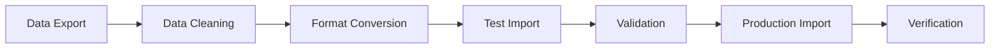

# Welcome to Santaan AI EMR
## Your Complete IVF Management Solution

### 🎯 Implementation Overview
- **Deployment Timeline**: 2-4 weeks
- **Training Duration**: 1 week
- **Go-Live Support**: 24/7 for first month
- **ROI Timeline**: 3-6 months

### 📋 What We'll Cover Today
1. **Pre-Deployment Checklist**
2. **Database Setup & Configuration**
3. **User Management & Permissions**
4. **Clinic Configuration**
5. **Data Migration Strategy**
6. **Staff Training Program**
7. **Go-Live Process**
8. **Ongoing Support & Monitoring**

---

# Phase 1: Pre-Deployment Checklist
## Infrastructure Requirements

### 🖥️ Technical Prerequisites
- **Internet Connection**: Minimum 10 Mbps (recommended 50+ Mbps)
- **Devices**: Modern browsers (Chrome, Firefox, Safari, Edge)
- **Operating Systems**: Windows 10+, macOS 10.14+, iOS 13+, Android 8+
- **Network**: HTTPS access to *.supabase.co and *.netlify.app

### 🔐 Security Requirements
- **Firewall Configuration**: Allow HTTPS (443) outbound
- **SSL Certificates**: Automatic (handled by platform)
- **Data Encryption**: AES-256 in transit and at rest
- **Compliance**: HIPAA, DPDP Act 2023, ART Act 2021

### 📊 Capacity Planning
- **Free Tier**: Up to 10,000 patients, 50k monthly users
- **Pro Tier**: Up to 160,000 patients, 100k monthly users
- **Current Recommendation**: Start with Free tier, upgrade as needed

---

# Phase 2: Database Setup & Configuration
## Supabase Backend Configuration

### 🗄️ Database Schema Deployment
```sql
-- Core tables already configured:
✅ patients - Patient records
✅ user_profiles - Staff accounts
✅ clinics - Multi-clinic support
✅ treatment_records - IVF cycles
✅ appointments - Scheduling
✅ file_attachments - Documents
✅ health_alerts - System monitoring
```

### 🔧 Required SQL Scripts
1. **Run in Supabase SQL Editor**:
   - `database/schema.sql` - Core database structure
   - `database/health_alerts_table.sql` - Monitoring system
   - `database/sample_data.sql` - Demo data (optional)

### 🔑 Authentication Setup
- **Row Level Security (RLS)**: Enabled by default
- **User Roles**: Admin, Doctor, Nurse, Embryologist, Receptionist
- **Clinic Isolation**: Data automatically separated by clinic_id

---

# Phase 3: User Management & Permissions
## Staff Account Configuration

### 👥 User Role Hierarchy
```
Admin (CIO/IT Manager)
├── Full system access
├── User management
├── Clinic configuration
└── System monitoring

Doctor (Medical Director)
├── Patient management
├── Treatment protocols
├── Clinical reports
└── Quality metrics

Nurse/Embryologist
├── Patient care tasks
├── Treatment execution
├── Lab data entry
└── Progress tracking

Receptionist
├── Appointment scheduling
├── Patient registration
├── Basic data entry
└── Communication
```

### 🔐 Permission Matrix
| Feature | Admin | Doctor | Nurse | Embryologist | Receptionist |
|---------|-------|--------|-------|--------------|--------------|
| Patient Records | ✅ Full | ✅ Full | ✅ Limited | ✅ Limited | ✅ Basic |
| Treatment Plans | ✅ Full | ✅ Create/Edit | ✅ Execute | ✅ Execute | ❌ View Only |
| Reports | ✅ All | ✅ Clinical | ✅ Nursing | ✅ Lab | ✅ Basic |
| Configuration | ✅ Full | ❌ None | ❌ None | ❌ None | ❌ None |

---

# Phase 4: Clinic Configuration
## Multi-Clinic Setup Process

### 🏥 Clinic Profile Setup
1. **Navigate to**: Configuration → Clinics → Add New Clinic
2. **Required Information**:
   - Clinic Name & Address
   - Contact Information
   - License Numbers
   - Operating Hours
   - Specializations

### 📋 Treatment Protocols Configuration
- **Standard IVF Protocols**: Pre-configured templates
- **Custom Protocols**: Clinic-specific modifications
- **Quality Metrics**: Success rate tracking
- **Compliance Settings**: Regulatory requirements

### 🔧 System Preferences
```yaml
Clinic Settings:
  - Time Zone: Auto-detect or manual
  - Language: English/Hindi/Regional
  - Currency: INR (Indian Rupees)
  - Date Format: DD/MM/YYYY (Indian standard)
  
Notification Settings:
  - Email Alerts: Enabled
  - SMS Integration: Optional
  - System Alerts: Critical only
  
Backup Settings:
  - Frequency: Daily (automatic)
  - Retention: 30 days
  - Location: Encrypted cloud storage
```

---

# Phase 5: Data Migration Strategy
## Existing Data Import Process

### 📊 Data Assessment
1. **Inventory Current Data**:
   - Patient records format (Excel, CSV, Database)
   - Treatment history completeness
   - Document digitization status
   - Data quality assessment

2. **Migration Planning**:
   - Prioritize active patients
   - Historical data importance
   - Cleanup requirements
   - Timeline estimation

### 🔄 Migration Process


### 📋 Migration Checklist
- [ ] Export existing patient data
- [ ] Clean and standardize formats
- [ ] Convert to Santaan EMR format
- [ ] Test import with sample data
- [ ] Validate data integrity
- [ ] Schedule production migration
- [ ] Verify all data imported correctly
- [ ] Update staff on new patient IDs

---

# Phase 6: Staff Training Program
## Comprehensive Training Schedule

### 📚 Training Modules (Week 1)

#### Day 1-2: System Overview
- **Morning**: Platform introduction and navigation
- **Afternoon**: Role-specific dashboards
- **Hands-on**: Basic patient lookup and data entry

#### Day 3-4: Core Workflows
- **Morning**: Patient registration and management
- **Afternoon**: Treatment protocol execution
- **Hands-on**: Complete patient journey simulation

#### Day 5: Advanced Features
- **Morning**: Reporting and analytics
- **Afternoon**: AI recommendations and insights
- **Hands-on**: Quality metrics and compliance

### 🎯 Training Delivery Methods
- **Live Sessions**: Interactive demonstrations
- **Hands-on Practice**: Sandbox environment
- **Video Tutorials**: Self-paced learning
- **Quick Reference**: Printed guides
- **Ongoing Support**: Help desk and chat

### 📊 Training Success Metrics
- **Competency Tests**: 90% pass rate required
- **User Adoption**: 100% staff onboarded
- **Support Tickets**: <5 per user in first month
- **User Satisfaction**: >4.5/5 rating

---

# Phase 7: Go-Live Process
## Production Deployment Strategy

### 🚀 Go-Live Timeline
```
Week -1: Final preparations
├── Data migration completion
├── User account activation
├── Final testing
└── Staff readiness confirmation

Day 0: Go-Live
├── 6 AM: System activation
├── 8 AM: Staff briefing
├── 9 AM: First patient registration
└── 6 PM: Day 1 review

Week +1: Stabilization
├── Daily check-ins
├── Issue resolution
├── Performance monitoring
└── User feedback collection
```

### 🔧 Go-Live Support
- **On-site Support**: Technical specialist available
- **24/7 Helpdesk**: Immediate issue resolution
- **Remote Monitoring**: System health tracking
- **Daily Reviews**: Progress and issue assessment

### 📋 Go-Live Checklist
- [ ] All staff accounts created and tested
- [ ] Data migration verified
- [ ] Backup systems confirmed
- [ ] Emergency procedures documented
- [ ] Support contacts distributed
- [ ] Performance baselines established

---

# Phase 8: System Health Monitoring
## Proactive Monitoring & Maintenance

### 🔍 Health Monitoring Dashboard
**Location**: Configuration → System Health

#### Real-time Metrics
- **Database Usage**: Current vs. limits
- **Active Users**: Concurrent sessions
- **Performance**: Response times
- **Error Rates**: System stability

#### Alert Thresholds
- **Warning (70%)**: Plan upgrade within 4 weeks
- **Critical (90%)**: Upgrade within 2 weeks
- **Emergency (95%)**: Immediate action required

### 📊 Capacity Planning
```
Current Status: Free Tier
├── Database: 45MB / 500MB (9%)
├── Users: 25 / 50,000 (0.05%)
├── Patients: 1,200 / 10,000 (12%)
└── Status: Healthy ✅

Projected Growth:
├── 6 months: 3,000 patients (30%)
├── 12 months: 6,000 patients (60%)
├── 18 months: 9,000 patients (90% - Upgrade needed)
└── 24 months: Pro tier required
```

### 🚨 Automated Alerts
- **Email Notifications**: CIO and IT team
- **Dashboard Indicators**: Visual health status
- **Weekly Reports**: Usage trends and projections
- **Upgrade Recommendations**: Cost-benefit analysis

---

# Ongoing Support & Maintenance
## Long-term Success Strategy

### 🛠️ Support Channels
1. **Priority Support Hotline**: 24/7 for critical issues
2. **Email Support**: Response within 4 hours
3. **Live Chat**: Business hours support
4. **Knowledge Base**: Self-service documentation
5. **Video Tutorials**: Step-by-step guides

### 📈 Performance Optimization
- **Monthly Reviews**: System performance analysis
- **Quarterly Updates**: Feature releases and improvements
- **Annual Planning**: Capacity and growth planning
- **Best Practices**: Ongoing optimization recommendations

### 🔄 Continuous Improvement
```
Monthly Cycle:
├── Performance Review
├── User Feedback Analysis
├── Feature Request Evaluation
└── System Optimization

Quarterly Cycle:
├── Capacity Planning Review
├── Security Assessment
├── Compliance Audit
└── Training Refresher

Annual Cycle:
├── Strategic Planning
├── Technology Roadmap
├── Contract Review
└── Expansion Planning
```

---

# Success Metrics & KPIs
## Measuring Implementation Success

### 📊 Technical KPIs
- **System Uptime**: >99.9% availability
- **Response Time**: <2 seconds average
- **Data Accuracy**: >99.5% integrity
- **User Adoption**: 100% staff active

### 🏥 Clinical KPIs
- **Patient Processing Time**: 30% reduction
- **Documentation Completeness**: >95%
- **Treatment Success Tracking**: Real-time
- **Compliance Score**: 100%

### 💰 Business KPIs
- **Administrative Efficiency**: 50% improvement
- **Cost Reduction**: 40% in admin overhead
- **Revenue Impact**: 20% increase potential
- **ROI Achievement**: 3-6 months

### 📈 Growth Metrics
- **Patient Volume**: Scalable growth
- **Staff Productivity**: Measurable improvement
- **Quality Scores**: Continuous improvement
- **Expansion Readiness**: Multi-clinic capability

---

# Next Steps & Action Items
## Your Implementation Roadmap

### 🎯 Immediate Actions (This Week)
1. **Schedule kick-off meeting** with implementation team
2. **Complete infrastructure assessment** checklist
3. **Identify key stakeholders** and champions
4. **Review data migration** requirements
5. **Plan staff training** schedule

### 📅 30-Day Milestones
- **Week 1**: Infrastructure setup and database configuration
- **Week 2**: User accounts and clinic configuration
- **Week 3**: Data migration and staff training
- **Week 4**: Go-live and initial support

### 🚀 90-Day Success Plan
- **Month 1**: Stabilization and optimization
- **Month 2**: Advanced feature adoption
- **Month 3**: Performance review and expansion planning

### 📞 Contact Information
- **Implementation Manager**: [Your contact]
- **Technical Support**: support@santaanemr.com
- **Emergency Hotline**: 24/7 support number
- **Documentation**: Complete guides in repository

---

# Thank You
## Welcome to the Future of IVF Healthcare

### 🎉 You're Now Ready to Transform Your Clinic!

**Your Santaan AI EMR implementation journey starts now.**

- ✅ **Complete technical roadmap** provided
- ✅ **Dedicated support team** assigned
- ✅ **Success metrics** defined
- ✅ **Growth strategy** planned

### 🚀 Let's Build Something Amazing Together!

**Questions? Let's discuss your specific requirements and timeline.**

---
